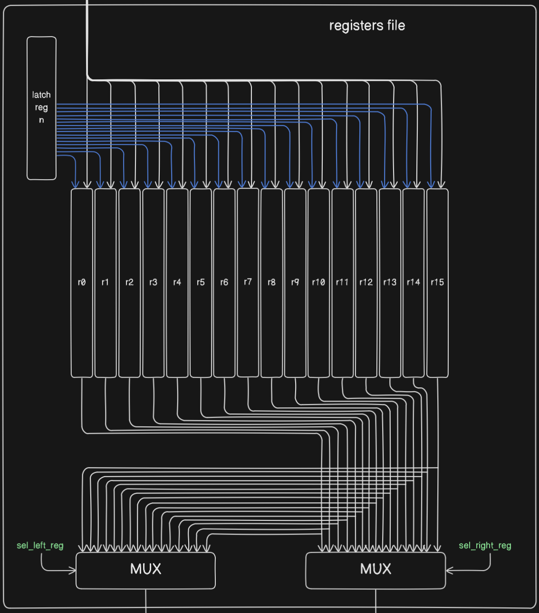
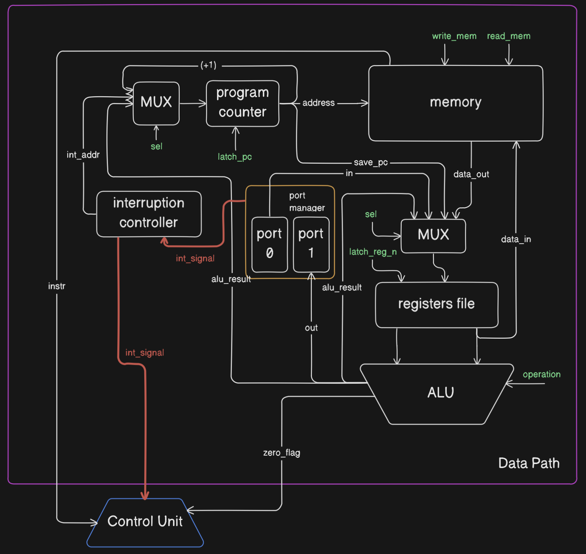
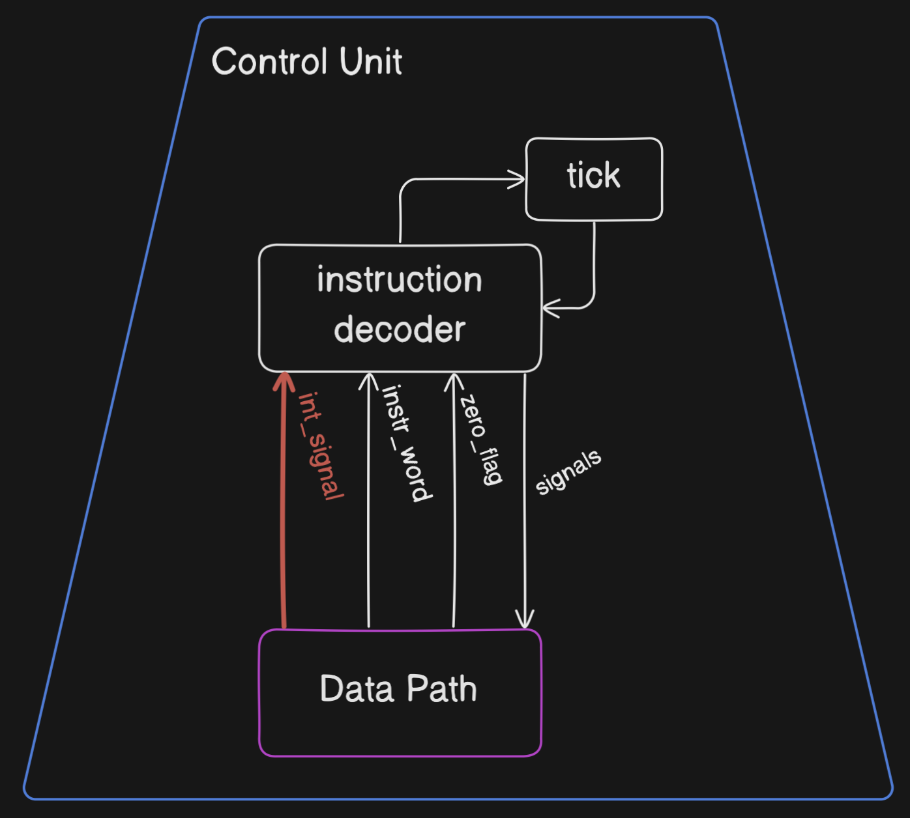

# Risc Machine. Эксперементальная модель процессора и транслятора

- Дениченко Александр Олегович, P3212
- asm | risc | neum | hw | tick -> instr | struct | trap -> stream | port | cstr | prob1 | cache
- Базовый вариант (без усложнения)

Примечания:

- Идеи для реализации модели процессора брались из документаций к MISP32, SPARC, ARM.

## Язык программирования

Синтаксис в расширенной БНФ.

```ebnf
<program> ::= { <section> }

<section> ::= "section" "." "text" ":" { <instruction> }
            | "section" "." "data" ":" { <data_definition> }
            | "int" <number> ":" { <interrupt_instruction> }

<instruction> ::= "ei"
               | "di"
               | "jmp" <label>
               | "jz" <label>
               | "jnz" <label>
               | "halt"
               | "move" <register> "," <operand>
               | "cmp" <register> "," <register>
               | "add" <register> "," <register> "," <register>
               | "sub" <register> "," <register> "," <register>
               | "mod" <register> "," <register> "," <register>
               | "load" <register> "," <address>
               | "store" <register> "," <address>
               | "in" <register> "," <number>
               | "out" <register> "," <number>
               | "inc" <register>
               | <label> ":"
               | <comment>

<interrupt_instruction> ::= "in" <register> "," <number>
                          | "out" <register> "," <number>
                          | "store" <register> "," <address>
                          | "load" <register> "," <address>
                          | "iret"
                          | <comment>

<data_definition> ::= <identifier> ":" <data_value>
                    | <comment>

<data_value> ::= <string>
               | <number>
               | "resb" <number>
               | <comment>

<address> ::= "(" <identifier> ")"
            | <identifier>

<register> ::= "r" <number>

<operand> ::= <register>
            | "#" <number>

<label> ::= "." <identifier>

<identifier> ::= <letter> { <letter> | <digit> }
              | <identifier> "." <identifier>

<number> ::= <digit> { <digit> }

<string> ::= "\"" { <character> } "\""

<letter> ::= "a" | "b" | "c" | ... | "z"
           | "A" | "B" | "C" | ... | "Z"

<digit> ::= "0" | "1" | "2" | "3" | "4" | "5" | "6" | "7" | "8" | "9"

<character> ::= <any printable ASCII character except quotation mark>

<comment> ::= "@" { <any printable ASCII character> }
```

Команды:

- `load a, b` - загрузка из памяти значения по адресу `b` в регистр `a`.
- `store a, b` - сохранение в память содержимого регистра `a` по адресу `b`.
- `add a, b, c` - сложение содержимого регистров `b`, `с`, и запись результата в регистр `a`.
- `sub a, b, c` - вычитание из регистра `b` регистра `с`, и запись результата в регистр `a`.
- `mod a, b, c` - остаток от деления регистра `b` на регистр `c`, и запись результата в регистр `a`.
- `inc a` - увеличение регистра `a` на 1.
- `cmp a, b` - выставление флагов по результату операции `a - b`.
- `di` - выключение прерываний.
- `ei` - включение прерываний.
- `iret` - возврат из прерывания.
- `halt` - остановка модели.
- `in a, b` - считывание значения из порта с номером `b` в регистр `a`.
- `out a, b` - вписывание значения в порт с номером `b` из регистра `a`.
- `jz a` - переход на адрес `a`, если флаг `z` положительный.
- `jnz a` - переход на адрес `a`, если флаг `z` отрицательный.
- `jmp a` - переход на адрес `a`.
- `move a, b` - загрузка значения из регистра/прямое `b` в регистр `a`.

## Организация памяти

- Память соответствует фон Неймановской архитектуре.
- Размер машинного слова - 32 бита.
- Адресация - абсолютная.
- `ALU` не имеет прямого доступа к памяти.
- Модель включает 16 регистров.
- Инструкции фиксированной длинны.

```text
           registers
+----------------------------+
| r0                         |
+----------------------------+
| r1                         |
+----------------------------+
| r2                         |
+----------------------------+
| r3                         |
+----------------------------+
| r4                         |
+----------------------------+
| r5                         |
+----------------------------+
| r6                         |
+----------------------------+
| r7                         |
+----------------------------+
| r8                         |
+----------------------------+
| r9                         |
+----------------------------+
| r10                        |
+----------------------------+
| r11                        |
+----------------------------+
| r12                        |
+----------------------------+
| r13/ar                     |
+----------------------------+
| r14/ir                     |
+----------------------------+
| r15/ipc                    |
+----------------------------+
```

Касательно регистров:

- Программисту доступны первые 12 регистров.
- Для управления регистрами имеется специальный `Registers File`.
    - Его вход подключен к мультиплексору для выбора значения, которое нужно вписать в регистр.
    - Для защёлкивания значения в регистр, нужно подать сигнал на конкретный регистр.
    - `Registers File` имеет 2 выхода, которые подключены к `ALU`. На каждый выход выбор регистра осуществляется через мультиплексор.
- Регистры напрямую связаны с памятью без 'прогона через `ALU`'.
- r12 предназначен для сохранения `PC` во время прерывания.
- ar используется для забора операнда у адресных инструкций.
- ir используется для считывания инструкции в начальном виде.
- ipc используется для сохранения `PC` при адресной инструкции.



```text
           memory
+----------------------------+
| 00 : jmp k                 |
| 01 : data (for example)    |
| 02 :      ...              | 
|           ...              | 
| k  : program start         |
|           ...              |
| n : interruption vector 1  |
+----------------------------+
```

- Ячейка памяти `0` соответствует инструкции jmp, которая осуществляет переход при цикле инициализации на адрес первой инструкции.
- Ячейка памяти `n`, является последнем элементом памяти и соответствует `вектору прерывания 1`.
- Расположение кода и данных не 'прибито' и отдано на конечную реализацию программисту.
- Секция с данными обозначается `section .data:` (может отсутсвовать). В блоке данных могу быть:
    - `Целочисленные данные` - под них отводится одна ячейка памяти;
    - `Строковые данные` - под них отводится `n` последовательных ячеек памяти, где `n` - длина строки
    (`нуль-терминатор` оставлен на усмотрение программисту);
    - `Буферные данные` - выделяются при помощи директивы `resb n`, где `n` - количество ячеек памяти, которое выделяется буфером при трансляции;
    - `Ссылочные` - это `целочисленные` переменные, но при начальной инициализации хранят адрес другой переменной. Под них отводится одна ячейка памяти.
- Переменные располагаются в памяти в таком порядке, в котором они прописаны в коде. Можно присваивать переменной строковые и целочисленные данные одновременно, перечисляя их через запятую.
- С ячейки памяти `k` начинаются инструкции, соответствующие исходному коду, прописанному в секции, которая обозначается как `.text`.

## Система ввода-вывода

- Реализован port-mapped IO.
- Ввод/вывод и доступ к памяти разделены.
- Пользователю доступно:
    - Порт ввода с адресом 0. Для упрощения подключен к регистровому файлу напрямую.
    - Порт вывода с адресом 1. Ввод в порт приходит с `ALU`.
- Для взаимодействия с портами используются команды `in/out` с явным указанием адреса.
- Ввод происходит по прерыванию, которое генерирует `port manager`.
    - Наличие прерывания проверяется в конце каждой инструкции, кроме `HALT`.
    - Если два и более прерываний прийдут одновременно, то обработается, последнее пришедшее.
    - При прерывании, если они разрешены, произойдёт переход на вектор прерывания.
- Для управления прерываниями сделан `Interruption Controller`. При прерывании он передаёт адрес вектора в PC.

## Система команд

Особенности процессора:

- Машинное слово -- 32 бита, знаковое.
- Доступ к памяти осуществляется по адресу, хранящемуся в специальном регистре `PC (programm counter)`.
  Установка адреса осуществляется тремя разными способами:
    - Путем инкрементирования текущего значения, записанного в `PC`;
    - Путем записи значения из `ALU`;
    - Путем записи адреса из `Interruption Controller`.
- Поток управления:
    - увеличение `PC` на `1` после каждой команды (увеличение зависит от выполненной команды;)
    - условный (`jz` или `jnz`) и безусловный (`jmp`) переходы
    - прерывания, при которых в `PC` происходит запись адреса вектора из `Interruption Controller`, причём `PC` заранее сохарняется в `r12`.

### Набор инструкций

- Команды языка однозначно транслируюстя в инструкции
- Декодирование инструкции происходит за один такт
- Выборка адреса или операнда зависит от типа адресации
    - Прямой адрес 3 такта
    - Косвенный адрес 4 такта
- Если происходит прерывание, то требуется 3 такта для настройки машины на вектор.

Исполнение инструкции:

| Инструкция | Кол-во тактов |
|:-----------|---------------|
| halt       | 0             |
| load       | 2             |
| store      | 2             |
| add        | 2             |
| sub        | 2             |
| mod        | 2             |
| inc        | 2             |
| cmp        | 1             |
| jz         | 1             |
| jnz        | 1             |
| jmp        | 1             |
| move       | 2             |
| iret       | 1             |
| ei         | 1             |
| di         | 1             |
| in         | 2             |
| out        | 2             |

### Кодирование инструкций

- Машинный код сериализуется в список JSON.
- Один элемент списка - одна инструкция.

Пример:

```json
[
   {
     "opcode": "jmp", 
     "op": 2, 
     "addrType": 0, 
     "term": [
       2, 
       ".loop"
     ]
   }
]
```

Где:

- `opcode` - строка с кодом операции;
- `op` - операнд;
- `addrType` - тип адресации;
- `term` - данные для облегчения восприятия
    - `term[0]` - индекс инструкции
    - `term[1]` - метки связанные с инструкцией

## Транслятор

Интерфейс командной строки: `translator.py <input_file> <target_file>`
Реализовано в модуле: [translator.py](./translator.py)

Он выполняет несколько ключевых шагов:

1. Удаление комментариев и пустых строк: Функция `remove_comments_and_blank_lines` удаляет комментарии и пустые строки из исходного кода, что упрощает дальнейшую обработку.

2. Обработка секции данных: Функция `process_data_section_in_list_inplace` обрабатывает секцию `.data` в списке строк ассемблера, преобразуя строки в `Unicode` значения, обрабатывая числа и специальные директивы `resb`.

3. Обработка меток: Функция `process_labels` извлекает метки из кода и сохраняет их в словаре, удаляя метки из списка строк и корректируя их индексы.

4. Перевод в машинный код: Функция `translate_to_machine_word` преобразует обработанные строки в формат инструкций или данных, подставляя метки.

5. Запуск трансляции: Основная функция `main` считывает исходный файл, выполняет перевод и записывает результат в целевой файл.

Правила генерации машинного кода:

- для команд, однозначно соответствующих инструкциям реализовано прямое отображение;
- в начало предварительного списка памяти вставляется инструкция jmp n, где n - адрес начала секции `.text`.
- в конец вставляется адрес вектора прерываний, он может быть помечен как `-` (пользователем не был задан вектор)

## Модель процессора

Интерфейс командной строки:`machine.py <machine_code_file> <input_file>`
Реализовано в модуле: [machine.py](./machine.py)

### DataPath



Реализован в классе `DataPath`.

`data_memory` - однопортовая память, поэтому либо читаем, либо пишем.

Сигналы (реализованы в виде методов класса):

- `latch_pc` - защёлкнуть значение в `PC`.
- `latch_n_reg` - защёлкнуть значение в n-ый регистр.
- `write_mem` - записать в память по адресу, взятому из `PC`.
- `read_mem` - прочитать память по адресу, взятому из `PC`.
- `int_signal` - сигал, исходящий из `port manager` и говорящий, что пришло прерывание.
- `zero_signal` - сигал, сообщающий `Control Unit` о флаге `ZERO`.

Флаги

- `zero` - отражает наличие нулевого значения по результату операции.

### ControlUnit



Реализован в классе `ControlUnit`.

- Hardwired (реализовано полностью на Python).
- Выполняет предварительную инициализацию машины - выполняет список инструкций, чтобы защелкнуть адрес первой инструкции в pc (метод `initialization_cycle`).
- Выполнение и декодирование инструкций происходит в методе `decode_and_execute_instruction`.
- Проверяет наличие прерываний и обрабатывает их (метод `check_and_handle_interruption`).
- `tick` нужен для подсчета тактов и отслеживания состояния машины на каждом такте.
Особенности работы модели:
- Цикл симуляции осуществляется в функции `simulation`.
- Шаг моделирования соответствует одному такту с выводом состояния в журнал.
- Для журнала состояний процессора используется стандартный модуль `logging`.
- Количество инструкций для моделирования лимитировано.
- После выполнения инструкции происходит проверка на вызов прерывания (функция `initiate_interruption`).
- Остановка моделирования осуществляется при:
    - превышении лимита количества выполняемых инструкций;
    - исключении `StopIteration` -- если выполнена инструкция `halt`.

## Тестирование

- Тестирование осуществляется при помощи golden test-ов.
- Настройка golden тестирования находится в [файле](./golden_asm_test.py)
- Конфигурация golden test-ов лежит в [директории](./golden)

Запустить тесты: `make test`

Обновить конфигурацию golden tests:  `make test-update-goldens`

CI при помощи Github Actions:

```yaml
name: Python CI

on:
  push:
    branches:
      - main

defaults:
  run:
    working-directory: ./

jobs:
  test:
    runs-on: ubuntu-latest

    steps:
      - name: Checkout code
        uses: actions/checkout@v4

      - name: Set up Python
        uses: actions/setup-python@v4
        with:
          python-version: 3.11

      - name: Install dependencies
        run: |
          python -m pip install --upgrade pip
          pip install poetry
          poetry install

      - name: Run tests and collect coverage
        run: |
          poetry run coverage run -m pytest .
          poetry run coverage report -m
        env:
          CI: true

  lint:
    runs-on: ubuntu-latest

    steps:
      - name: Checkout code
        uses: actions/checkout@v4

      - name: Set up Python
        uses: actions/setup-python@v4
        with:
          python-version: 3.11

      - name: Install dependencies
        run: |
          python -m pip install --upgrade pip
          pip install poetry
          poetry install

      - name: Check code formatting with Ruff
        run: poetry run ruff format --check .

      - name: Run Ruff linters
        run: poetry run ruff check .
```

где:

- `poetry` -- управления зависимостями для языка программирования Python.
- `coverage` -- формирование отчёта об уровне покрытия исходного кода.
- `pytest` -- утилита для запуска тестов.
- `ruff` -- утилита для форматирования и проверки стиля кодирования.

Пример использования и журнал работы процессора на примере программы:

```text
section .text:
    add r0, r1, r2
    halt
```

Журнал работы:

```shell
./translator.py examples/add.asm examples/struct.txt 
source LoC: 3 code instr: 4
```

(Пришло прерывание, так как в input были данные с расписанием, но прерывания запрещены по стандарту)

```shell
./machine.py examples/struct.txt examples/input.txt
DEBUG:root:
        TICK: 1   PC: 0   Z_FLAG:   0 
        r0: 0 |  r1: 0 |  r2: 0 | r3: 0 | r4: 0 | r5: 0 | r6: 0 | r7: 0 | r8: 0 | r9: 0 | r10: 0 | r11: 0 | r12: 0 | ar: 0 | ir: jmp| ipc: 0 |  MEM(PC) -> IR |         [instruction: jmp #0] |PORT_0: 0 |PORT_1: 0| 
        CONTROLLER_INT: False 
DEBUG:root:
        TICK: 2   PC: 0   Z_FLAG:   0 
        r0: 0 |  r1: 0 |  r2: 0 | r3: 0 | r4: 0 | r5: 0 | r6: 0 | r7: 0 | r8: 0 | r9: 0 | r10: 0 | r11: 0 | r12: 0 | ar: 1 | ir: jmp| ipc: 0 |  IR[OPERAND] -> AR |     [instruction: jmp #0] |PORT_0: 0 |PORT_1: 0| 
        CONTROLLER_INT: False 
DEBUG:root:
        TICK: 3   PC: 1   Z_FLAG:   0 
        r0: 0 |  r1: 0 |  r2: 0 | r3: 0 | r4: 0 | r5: 0 | r6: 0 | r7: 0 | r8: 0 | r9: 0 | r10: 0 | r11: 0 | r12: 0 | ar: 1 | ir: jmp| ipc: 0 |  0 + AR -> PC |  [instruction: jmp #0] |PORT_0: 0 |PORT_1: 0| 
        CONTROLLER_INT: False 
DEBUG:root:
        TICK: 4   PC: 1   Z_FLAG:   0 
        r0: 0 |  r1: 0 |  r2: 0 | r3: 0 | r4: 0 | r5: 0 | r6: 0 | r7: 0 | r8: 0 | r9: 0 | r10: 0 | r11: 0 | r12: 0 | ar: 1 | ir: add| ipc: 0 |  MEM[PC] -> IR |         [instruction: add #1] |PORT_0: 0 |PORT_1: 0| 
        CONTROLLER_INT: False 
DEBUG:root:
        TICK: 5   PC: 1   Z_FLAG:   1 
        r0: 0 |  r1: 0 |  r2: 0 | r3: 0 | r4: 0 | r5: 0 | r6: 0 | r7: 0 | r8: 0 | r9: 0 | r10: 0 | r11: 0 | r12: 0 | ar: 1 | ir: add| ipc: 0 |  R1 + R2 -> R0 |         [instruction: add #1] |PORT_0: 0 |PORT_1: 0| 
        CONTROLLER_INT: False 
DEBUG:root:
        TICK: 6   PC: 2   Z_FLAG:   1 
        r0: 0 |  r1: 0 |  r2: 0 | r3: 0 | r4: 0 | r5: 0 | r6: 0 | r7: 0 | r8: 0 | r9: 0 | r10: 0 | r11: 0 | r12: 0 | ar: 1 | ir: add| ipc: 0 |  PC + 1 -> PC |  [instruction: add #1] |PORT_0: 0 |PORT_1: 0| 
        CONTROLLER_INT: False 
DEBUG:root:
        TICK: 7   PC: 2   Z_FLAG:   1 
        r0: 0 |  r1: 0 |  r2: 0 | r3: 0 | r4: 0 | r5: 0 | r6: 0 | r7: 0 | r8: 0 | r9: 0 | r10: 0 | r11: 0 | r12: 0 | ar: 1 | ir: halt| ipc: 0 |  MEM[PC] -> IR |        [instruction: halt #2] |PORT_0: 65 |PORT_1: 0| 
        CONTROLLER_INT: True | INT_VECTOR_ADDR: 1048566 | INT_ENABLED: False | INT_HANDLING: False | 


instr_counter: 3 ticks: 7
```

Пример тестирования:

```shell
make test
poetry run pytest -v
Creating virtualenv risk-OB-oNtAW-py3.11 in /Users/alexalex/Library/Caches/pypoetry/virtualenvs
================================================== test session starts ===================================================
platform darwin -- Python 3.11.8, pytest-8.2.0, pluggy-1.5.0 -- /opt/homebrew/opt/python@3.11/bin/python3.11
cachedir: .pytest_cache
rootdir: /Users/alexalex/Desktop/risk_machine
configfile: pyproject.toml
plugins: golden-0.2.2
collected 6 items

golden_asm_test.py::test_translator_asm_and_machine[golden/prob1_asm.yml] PASSED                                   [ 16%]
golden_asm_test.py::test_translator_asm_and_machine[golden/cat_asm.yml] PASSED                                     [ 33%]
golden_asm_test.py::test_translator_asm_and_machine[golden/all_instr_asm.yml] PASSED                               [ 50%]
golden_asm_test.py::test_translator_asm_and_machine[golden/test_asm.yml] PASSED                                    [ 66%]
golden_asm_test.py::test_translator_asm_and_machine[golden/hello_username_asm.yml] PASSED                          [ 83%]
golden_asm_test.py::test_translator_asm_and_machine[golden/hello_world_asm.yml] PASSED                             [100%]

=================================================== 6 passed in 3.17s ====================================================
```

```text
| ФИО                             | алг            | LoC | code инстр. | инстр. | такт. |
| Дениченко Александр Олегович    | all_instr      | 40  | 68          | 306    | 682   |
| Дениченко Александр Олегович    | cat            | 15  | 11          | 293    | 615   |
| Дениченко Александр Олегович    | hello_username | 56  | 70          | 359    | 1340  |
| Дениченко Александр Олегович    | hello_world    | 21  | 26          | 102    | 390   |
| Дениченко Александр Олегович    | prob1          | 23  | 18          | 7802   | 18740 |
| Дениченко Александр Олегович    | test           | 26  | 17          | 12     | 39    |
```
